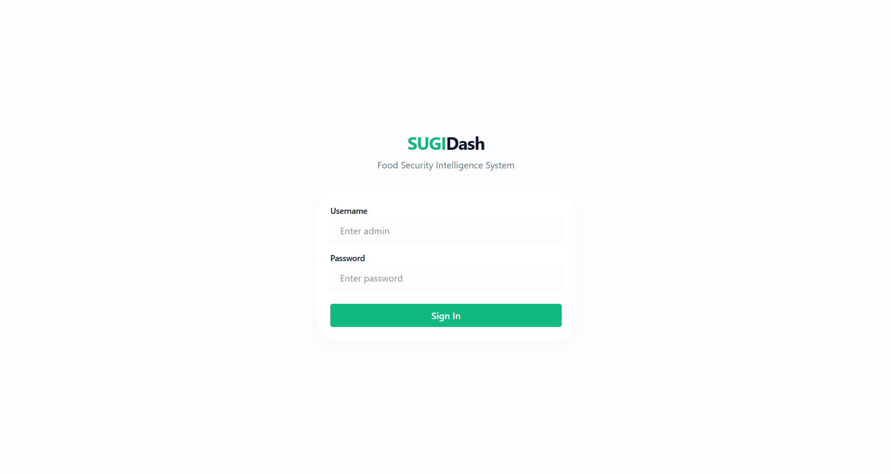
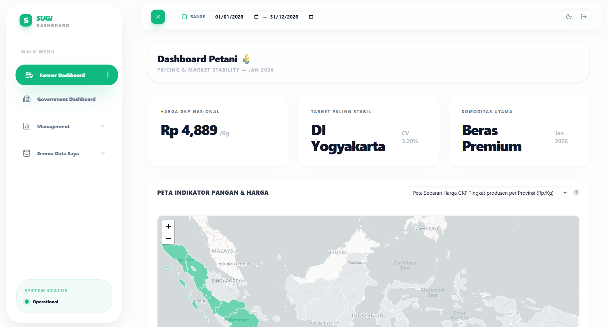
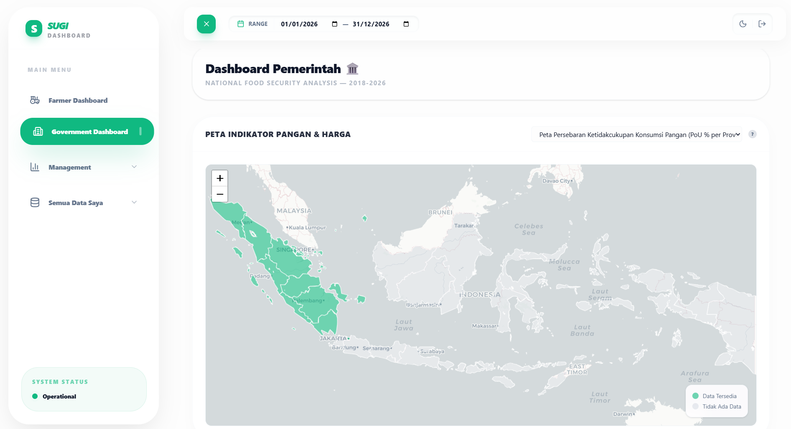
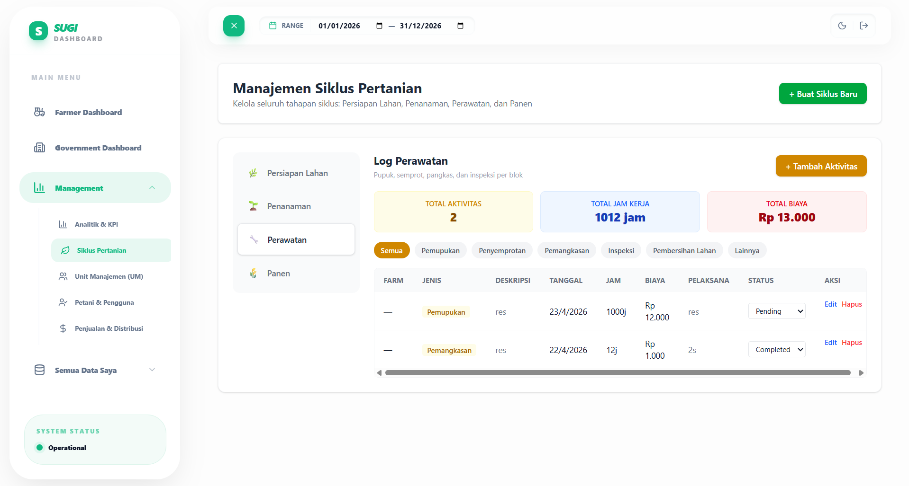

# SUGIDash 🌾🏛️

**SUGIDash** (Sugi Dashboard) is a premium, high-performance **End-to-End Agricultural Management & Intelligence System**. It provides real-time data visualization for agricultural pricing, national food security trends, and complete farm lifecycle management across Indonesia.

## 🚀 Key Features

- **Authentication & RBAC**: JWT-based login with bcrypt password hashing. Four roles: `superadmin`, `government`, `farmer_owner`, `farmer`. Role-based route guards and sidebar visibility.
- **Master Data Management**: Full CRUD for Farms, Blocks (land parcels), Crop Types, and Activity Types — used across all downstream modules.
- **Management Dashboard (Company/Leader)**:
  - **KPI Analytics**: Real-time business metrics like Total Yield (Tons), ROI (%), Cost per Kg, and Average Price.
  - **Yield Trends**: Comparative month-by-month analysis of yields for Company, Groups, and Independent actors using **Recharts**.
  - **Alert & Notification System**: Automated tracking of closing harvest windows and unassigned tasks.
- **Agricultural Lifecycle Management**:
  - **Land Preparation**: Full CRUD for land opening/closing with cost tracking.
  - **Planting Log**: Track crop variety, density (seeds/ha), and area coverage.
  - **Maintenance tracking**: Detailed log for fertilization, spraying, and pruning with labor hour and cost aggregation.
  - **Harvest Management**: Open/Close harvest windows with expected vs. actual yield comparison and overdue alerts.
- **Unit Management (UM)**: Farmer-to-Block assignment system — assign farmers to specific land blocks with auto-detected farm.
- **Farmer & User Management**:
  - Role-based Access Control (RBAC) with 4 roles.
  - Organization-specific user filtering, search, and deactivation.
- **Sales & Distribution**:
  - Record sales to Mills, Middlemen, or Direct markets with expense tracking.
  - Auto-computed revenue and invoice reference tracking.
- **Farmer & Government Dashboards**: Live data from 14 food security datasets with clickable chart cards and detail modals.
- **Chart Detail Modal**: Click any chart card to view a full-size 500px chart with ESC/backdrop/close-button dismissal.
- **DataTable** with page size selector (5/10/20/50), first/last navigation, total entry count, and smart page numbering.
- **Premium Glassmorphism UI**: A cutting-edge, minimalist "Emerald & White" aesthetic with butter-smooth transitions (`cubic-bezier` easing) and high-end animations.
- **Real API Fallback**: Dashboards gracefully fall back to mock data when the API is unreachable.

## 🖼️ User Interface Preview

### 🔑 1. Authentication & Login Portal
A secure, role-based login interface providing distinct entry points for Farmers, Government, and Management roles.



---

### 🌾 2. Farmer Dashboard
Empowering local agriculturalists with real-time grain pricing (GKP) visualizations and localized farm highlights.



---

### 🏛️ 3. Government & Security Dashboard
A macro-level dashboard tracking national food security indexes, regional pricing, and harvest projections.



---

### 🔄 4. Agricultural Lifecycle Management
An end-to-end tracking tool covering land preparation, planting schedules, maintenance logging, and harvest optimization.



## 🛠️ Tech Stack

### Frontend
- **React 19** (Vite-based)
- **Tailwind CSS 4.0** (with custom glassmorphism utilities)
- **Recharts** (Advanced business & yield analytics)
- **Lucide React** (Modern iconography)
- **Leaflet & React-Leaflet** (Geographical data maps)
- **React Router 7** (Protected dashboard paths)

### Backend
- **Node.js** (Express)
- **MongoDB / Mongoose** (Complex aggregation pipelines for real-time KPI computation)
- **JWT** (JSON Web Tokens for stateless authentication)
- **bcryptjs** (Password hashing)
- **RBAC Middleware** (Role-based security across all routes)

## 📁 Project Structure

```bash
SUGI-Dashboard-DEMO/
├── backend/                # Node.js + Express API
│   ├── src/
│   │   ├── config/         # Database and environment configurations
│   │   ├── controllers/    # Request handlers (logic for specific routes)
│   │   ├── middlewares/    # Custom Express middlewares (RBAC, Auth)
│   │   ├── models/         # Mongoose schemas (Sale, Expense, UM, Cycle, Activity, etc.)
│   │   ├── routes/         # Modular API endpoints (lifecycle, sales, um, etc.)
│   │   ├── scripts/        # Utility and maintenance scripts
│   │   ├── services/       # Business logic & complex aggregations (kpiService)
│   │   └── utils/          # Helper functions
│   ├── .env                # Environment variables (Mongo URI, Port, JWT Secret)
│   ├── server.js           # Main server entry point
│   └── package.json        # Backend dependencies and scripts
├── frontend/               # Vite + React source code
│   ├── public/             # Static assets (GeoJSON maps, public icons)
│   ├── src/
│   │   ├── api/            # Central managementApi client for backend communication
│   │   ├── assets/         # Images, fonts, and brand assets
│   │   ├── components/     # Reusable UI components
│   │   │   ├── charts/     # Recharts implementations
│   │   │   ├── common/     # Shared UI elements (Buttons, Inputs, DataTable, ChartDetailModal)
│   │   │   ├── layout/     # Page structural components (Sidebar, TopBar, MainLayout)
│   │   │   ├── management/ # Module-specific components
│   │   │   └── map/        # Leaflet map implementations
│   │   ├── contexts/       # React Context API for global state (AuthContext, ThemeContext, FilterContext)
│   │   ├── data/           # Reference data, types, and constants
│   │   ├── hooks/          # Custom React hooks (useManagementData, useGenericResource)
│   │   ├── pages/          # Main dashboard views (Farmer, Gov, Management, Lifecycle, UM, etc.)
│   │   │   └── master/     # Master data CRUD pages (Farm, Block, CropType, ActivityType)
│   │   ├── styles/         # Global CSS and Tailwind theme extensions
│   │   ├── utils/          # Frontend helper functions and formatters
│   │   ├── App.jsx         # Main application component & routing
│   │   └── main.jsx        # React DOM entry point
│   ├── vite.config.js      # Vite configuration
│   └── package.json        # Frontend dependencies and scripts
└── README.md               # Main project documentation
```

## ⚙️ Getting Started

### 1. Prerequisites
- Node.js (v18+)
- MongoDB (Running locally or via Atlas)

### 2. Setup Backend
```bash
cd backend
npm install
```

Create a `.env` file in the `backend/` directory with the following content:
```env
PORT=5000
MONGO_URI=mongodb://localhost:27017/sugi-dashboard-demo
JWT_SECRET=supersecret
```

Seed default data (users, crop types, activity types):
```bash
npm run seed
```

Reset database and re-seed:
```bash
npm run reset
```

Then start the server:
```bash
npm start   # Server runs on http://localhost:5000
# or
npm run dev # With nodemon hot-reload
```

### 3. Setup Frontend
```bash
cd frontend
npm install
npm run dev # App runs on http://localhost:5173
```

### 4. Credentials

| Role | Email | Password |
|------|-------|----------|
| Super Admin | `superadmin@sugi.id` | `superadmin123` |
| Government | `government@sugi.id` | `government123` |
| Farmer Owner | `owner@sugi.id` | `owner123` |

### 5. API Endpoints

**Authentication:**
- `POST /api/auth/login` — Login with email & password, returns JWT token
- `GET /api/auth/me` — Get current user profile

**Master Data:**
- `GET/POST /api/master-data/farms` — List / Create farms
- `GET/PUT/DELETE /api/master-data/farms/:id` — Get / Update / Delete farm
- `GET/POST /api/master-data/blocks` — List / Create blocks
- `GET/POST /api/master-data/crop-types` — List / Create crop types
- `GET/POST /api/master-data/activity-types` — List / Create activity types

**Assignments:**
- `GET/POST /api/assignments/farmer-assignments` — List / Create farmer-to-block assignments
- `DELETE /api/assignments/farmer-assignments/:id` — Remove assignment
- `GET/POST /api/assignments/task-assignments` — List / Create task-to-farmer assignments

**Farmers:** `GET/POST/PUT/DELETE /api/farmers`
**Sales:** `GET/POST/DELETE /api/sales`
**Expenses:** `GET/POST /api/expenses`
**Dashboards:** `GET /api/dashboard/farmer`, `GET /api/dashboard/government`

---

Built with ❤️ for Indonesian Agricultural Excellence.
